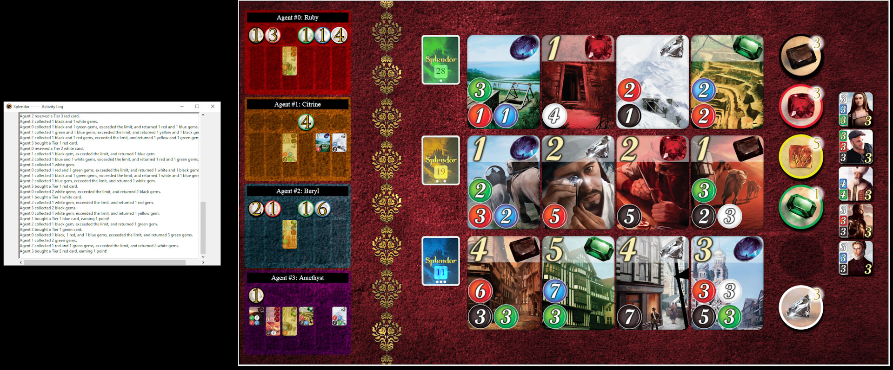

# Splendor Project Template

You must fully and carefully read the assignment specification and instructions detailed in this file. You are NOT to modify this file in any way.

* **Course:** [COMP90054 AI Planning for Autonomy](https://handbook.unimelb.edu.au/subjects/comp90054) @ Semester 1, 2024.
* **Instructor:** Dr. Nir Lipovetzky, Dr. Joseph West, & Dr. Sarita Rosenstock
* **Deadline Team Registration:** Monday 29 April, 2024 @ 18:00 (start of Week 9)
* **Deadline Preliminary (Individual) Submission:** Monday 6 May, 2024 @ 18:00 (start of Week 10)
* **Deadline Wiki & Final Submission:** Monday 20 May, 2024 @ 18:00 (start of Week 12)
* **Deadline Individual Self-Evaluation:** Friday 24 May, 2024 @ 18:00 (Week 12)
* **Course Weight:** 35% total, comprising 10% (preliminary competition) + 10% (final competition) + 15% (wiki)
* **Assignment type:** Groups of 3 (ideally) or 2 (not recommended)
* **CLOs covered:** 1-5

The purpose of this project is to implement a Splendor Autonomous Agent that can play and compete in the UoM COMP90054-2024 _Splendor tournament_:

 
 
    
 

 
 **Please carefully read the rules of the [Splendor game](https://cdn.1j1ju.com/medias/7f/91/ba-splendor-rulebook.pdf)**. Splendor can be understood as a sequential decision problem about resource management. Understanding it well and designing a controller for it is part of the expectations for this project. 
 

### Table of contents

  * [1. Your task](#1-your-task)
     * [Important basic rules](#important-basic-rules)
  * [2. Deliverables and submission](#2-deliverables-and-submission)
     * [Preliminary submission (Monday week 10)](#preliminary-individual-submission-monday-week-10)
     * [Wiki and Final submission (Monday week 12)](#wiki-and-final-submission-monday-week-12)
     * [Individual Reflection (Friday week 12)](#individual-reflection-friday-week-12)
  * [3. Online Server](#3-online-server)
  * [4. Marking Criteria](#4-marking-criteria)
  * [5. Important information](#5-important-information)
     * [How to create the Wiki](#how-to-create-the-wiki)
     * [Corrections](#corrections)
     * [Late submissions &amp; extensions](#late-submissions--extensions)
     * [About this repo](#about-this-repo)
     * [Academic Dishonesty](#academic-dishonesty)
  * [6. COMP90054 Code of Honour &amp; Fair Play](#6-comp90054-code-of-honour--fair-play)
  * [7. Conclusion](#7-conclusion)
     * [Acknowledgements](#acknowledgements)

## 1. Your task

This is a **group project** of 3 members. Now that you have a repo, the next thing to do is to register your team in the [Project Contest Team Registration Form](https://forms.gle/pfNib5eDTTccaEJp8) (assuming you followed ED instruction and got a Canvas Teams Name) and tell the other students to join the team in GitHub Classroom. 
 
**Your task** is to develop an autonomous Splendor agent team to play the **Splendor Contest** by suitably modifying file [`agents/<t_XXX>/myTeam.py`](agents/t_XXX/myTeam.py) (please replace "XXX" in "<t_XXX>" with your own Canvas Teams ID and there maybe some other auxiliarly files you may implement). For example, if your team's Canvas Teams Name is "Canvas Teams 1", then you should change your folder from `agents/t_XXX/` to `agents/t_001/`. The code submitted should aim to be commented at high standards, be error-free, and _never crash_. 

In your solution, you have to use at **least 3 AI-related techniques** (**2 techniques at least for groups of 2**, but it is highly not recommended.) that have been discussed in the subject or explored by you independently, and you can combine them in any form. **We won't accept a final submission with less than 3 (or 2 depends on your final group size) techniques**. Some candidate techniques that you may consider are:

1. Blind or Heuristic Search Algorithms (using general or Splendor specific heuristic functions).
2. Classical Planning (PDDL and calling a classical planner).
3. Policy iteration or Value Iteration (Model-Based MDP).
4. Monte Carlo Tree Search or UCT (Model-Free MDP).
5. Reinforcement Learning – classical, approximate or deep Q-learning (Model-Free MDP).
6. Goal Recognition techniques (to infer intentions of opponents).
7. Game Theoretic Methods.

We recommend you to start by using search algorithms, given that you already implemented their code in the first project. You can always use hand coded decision trees to express behaviour specific to Splendor, but they won't count as a required technique. You are allowed to express domain knowledge, but remember that we are interested in "autonomy", and hence using techniques that generalise well. The 7 techniques mentioned above can cope with different games much easier than any decision tree (if-else rules). If you decide to compute a policy, you can save it into a file and load it at the beginning of the game, as you have 15 seconds before every game to perform any pre-computation. 

 
### Important basic rules 

When submitting a solution, please make absolutely sure you adhere to the following rules:

* Your code **must run _error-free_ on Python 3.8+**. Staff will not debug/fix any code. If your code crashes in any execution, it will not have any valid results from the online server. To ensure your code is error-free, you can test with docker locally (following this [link](docker/README.md))
* You can install Python 3.8 from the [official site](https://www.python.org/dev/peps/pep-0494/), or set up a [Conda environment](https://www.freecodecamp.org/news/why-you-need-python-environments-and-how-to-manage-them-with-conda-85f155f4353c/) or an environment with [PIP+virtualenv](https://uoa-eresearch.github.io/eresearch-cookbook/recipe/2014/11/26/python-virtual-env/).

* Your code **must not contain any personal information**, like your student number or your name. That info should go in the [TEAM.md](TEAM.md) file, as per instructions below. If you use an IDE that inserts your name, student number, or username, you should disable that.

* You are **not to change or affect (e.g., redirect) the standard output or error channels** (`sys.stdout` and `sys.stderr`) beyond just printing on standard output, including `logging`. If your file mentions any of them it will be breaking the "fair play" of the course (see below). These are used to report each game output and errors, and they should not be altered as you will be interfering negatively with the contest and with the other team's printouts. 

* Being a group assignment, you must **use your project Github** repository and GitHub team to collaborate among the members. The group will have write access to the same repository, and also be members of a GitHub team, where members can, and are expected to, engage in discussions and collaboration. Refer to the marking criteria below. 

## 2. Deliverables and submission

Pencil the following info in your calendar.

### Team Registration: (Monday Week 9)

Please register your team of 3 submitting [Project Contest Team Registration Form](https://forms.gle/pfNib5eDTTccaEJp8)

### Preliminary (Individual) submission (Monday week 10)

This is an individual submission, **each member** should finish the following steps:
 
1. The `agents/<t_XXX>/myTeam.py` implementing your AI-based Splendor agent team as per instructions above by tagging the relevant commit as "`<your_student_id>`". It is recommand to create your own branch to develop (please try not to use your student id as the branch name to avoid confusion in pushing tags.)
2. Submit your individual self evaluation to Canvas.
3. Fill the [Project Certification \& Contribution Form (PRELIMINARY)](https://forms.gle/4fjZqLL94tt2n5TX7).
 > :warning: Each member of the team should fill a separate certification form. Members who do not certify will not be marked and will be awarded zero marks.

### Wiki and Final Submission (Monday week 12)

In the **final submission** you are to submit your final submission as a group, which includes:

1. The `agents/<t_XXX>/myTeam.py` implementing your AI-based Splendor agent team as per instructions above by tagging the relevant commit as "`submission`". 
2. A completed [TEAM.md](TEAM.md) file, with all the team member details. 
3. A **wiki** in your GitHub team repository, documenting and critically analysing your Splendor agent system. 
    * Take a look at the **wiki** provided as a guideline of the structure that you should follow.
    * At the very minimum the eiki should describe the approaches implemented, a small table comparing the different agents/techniques you tried showing their performances in several scenarios (briefly the table), and an analysis of the strengths and weaknesses of your solution. For example, you may want to show how the addition of a given technique or improvement affected your system at some important point in the development. 
    * However, you can also discuss other aspects, such as other techniques you experimented with (and why they were not used in the final system), future extensions or improvements on your system, etc.

And **each member** should submit:

4. A filled [Project Certification & Contribution Form (FINAL)](https://forms.gle/yWNMn6hzHuSRbVYw6).
> :warning: Each member of the team should fill a separate certification form. Members who do not certify will not be marked and will be awarded zero marks.

Submit your project substantially before the deadline, preferably one day before. Submitting close to the deadline could be risky and you may fail to submit on time, for example due to loss of Internet connection or server delays. There will be **no extensions** based on these unforeseen problems. 

### Individual Reflection (Friday week 12)

Each team member submits a short (one page maximum) PDF group reflection to Canvas (under Assignments) that answers the following questions:

Details to be released soon.

## 3. Online Server
To be released soon

## 4. Marking Criteria

To be released soon.

### 4.4 Teamwork and Software Engineering professional practice

Besides the correctness and performance of your solutions, you must **follow good and professional SE practices**, including good use of git and professional communication during your development such as:

* _Commit early, commit often:_ single or few commits with all the solution or big chunks of it, is not good practice.
* _Use meaningful commit messages:_ as a comment in your code, the message should clearly summarize what the commit is about. Messages like "fix", "work", "commit", "changes" are poor and do not help us understand what was done.
* _Use atomic commits:_ avoid commits doing many things; let alone one commit solving many questions of the project. Each commit should be about one (little but interesting) thing. 
* _Use the Issue Tracker:_ use issues to keep track of tasks, enhancements, and bugs for your projects. They are also a great way to collaborate in a team, by assigning issues and discussing on them directly. Check GitHub [Mastering Issues Guide](https://guides.github.com/features/issues/).
* _Follow good workflow:_ use the standard branch-based development workflow, it will make your team much more productive and robust! Check GitHub [Workflow Guide](https://guides.github.com/introduction/flow/). 
* _Communicate in the GitHub Team:_ members of the group are expected to communicate, in an adequate and professional way, in the GitHub team created along the repo. For example, you could use GitHub team discussions, use issues and pull requests to track development status, or create project plans. Video and voice chats outside of GitHub are permissible (and encouraged), but text communication should be through the GitHub team where possible.

   

* _Pair program_ if possible. You can use VScode and [this extension](https://docs.microsoft.com/en-us/visualstudio/liveshare/use/vscode) to liveshare your local code with your team members as guests. In pair programming, take turns at who's hosting the session (driving the coding) and who's observing. Alternatively, use any online platform to share your screen and program with your team members. Pair Programming is a widely used practice in industry. it is known to reduce errors, improve code quality, improve learning of all members, and reinforce the quality of the team's communication. See this entry about [pair programming](https://en.wikipedia.org/wiki/Pair_programming)

We will also inspect the **commit history** and **GitHub team** to check for high-quality SE practices and meaningful contributions of members. The results of this check can affect the overall mark of the project and point deductions may be applied when poor SE practices have been used along with uneven team members contributions (reported in the submission form). For example, few commits with a lot of code changes, or no or poor communication in the corresponding GitHub team may result in deductions, even if the performance is perfect. We need to make sure that you work as a team where everyone is contributing. This is a key skill in industry. “Effective teamwork begins and ends with communication.” — Mike Krzyzewski.

## 5. Important information

### How to create the Wiki

You can use the template given in [wiki-template](wiki-template/) (will be released soon) folder in order to create your wiki. Watch the video below.

### Corrections

From time to time, students or staff find errors (e.g., typos, unclear instructions, etc.) in the assignment specification. In that case, a corrected version of this file will be produced, announced, and distributed for you to commit and push into your repository.  Because of that, you are NOT to modify this file in any way to avoid conflicts.

### Late submissions & extensions

Late submissions are truly inconvenient for this large assessment, as it involves other team members working for several weeks. Late submissions may not enter into the "official" contest and the team may then not receive feedback on time.  The project is available for 6 weeks, as a team, each member should plan and start early in order to minimize any unexpected circumstances near the end. Extensions will only be permitted in _exceptional_ circumstances; refer to [this question](https://docs.google.com/document/d/17YdTmDC54WHq0uZ-2UX3U8ESwULyBDJSD4SjKCrPXlA/edit?usp=sharing) in the course FAQs. Note that workload and/or heavy load of assignments will not be accepted as exceptional circumstances for an extension (we are not allowed to give any extension beyond Week 12 either). 

### About this repo

You must ALWAYS keep your fork **private** and **never share it** with anybody in or outside the course, except your teammates, _even after the course is completed_. You are not allowed to make another repository copy outside the provided GitHub Classroom without the written permission of the teaching staff.  

> **_Please do not distribute or post solutions to any of the projects._**

### Academic Dishonesty
 
**Academic Dishonesty:** This is an advanced course, so we expect full professionalism and ethical conduct.  Plagiarism is a serious issue. Please **don't let us down and risk our trust**. The staff take academic misconduct very seriously. Sophisticated _plagiarism detection_ software (e.g., [Codequiry](https://codequiry.com/), [Turinitin](https://www.turnitin.com/), etc.) will be used to check your code against other submissions in the class as well as resources available on the web for logical redundancy. These systems are really smart, so just do not risk it and keep professional. We trust you all to submit your own work only; please don't let us down. If you do, we will pursue the strongest consequences available to us according to the [**University Academic Integrity policy**](https://policy.unimelb.edu.au/MPF1310/).

**We are here to help!:** We are here to help you! But we don't know you need help unless you tell us. We expect reasonable effort from you side, but if you get stuck or have doubts, please seek help. We will ran labs to support these projects, so use them! While you have to be careful to not post spoilers in the forum, you can always ask general questions about the techniques that are required to solve the projects. If in doubt whether a questions is appropriate, post a Private post to the instructors.

**Silence Policy:** A silence policy will take effect **48 hours** before this assignment is due. This means that no question about this assignment will be answered, whether it is asked on the newsgroup, by email, or in person. Use the last 48 hours to wrap up and finish your project quietly as well as possible if you have not done so already. Remember it is not mandatory to do all perfect, try to cover as much as possible. By having some silence we reduce anxiety, last minute mistakes, and unreasonable expectations on others. 

## 6. COMP90054 Code of Honour & Fair Play

We expect every UoM student taking this course to adhere to the **Code of Honour** under which every learner-student should:

* Submit their own original work.
* Do not share answers with others.
* Report suspected violations.
* Not engage in any other activities that will dishonestly improve their results or dishonestly improve or damage the results of others.

Being a contest, we expect **fair play** of all teams in this project. If you are in doubt of whether something would break the good spirit of the project, you must check with us early, not wait to be discovered. Any behaviour or code providing an unfair advantage or causing harm will be treated very seriously. We trust you, do not let us down and be a fair player.

Unethical behaviour is extremely serious and consequences are painful for everyone. We expect enrolled students/learners to take full **ownership** of your work and **respect** the work of teachers and other students.

## 7. Conclusion

This is the end of the project specification. 
> :loudspeaker: Remember to also read the [splendor.md](Splendor/splendor.md) file containing technical information that will come very useful.

If you still have doubts about the project and/or this specification do not hesitate asking in the [ED Discussion Forum](https://edstem.org/au/courses/15792/discussion/) and we will try to address it as quickly as we can!

**GOOD LUCK and HAPPY SPLENDOR!**

